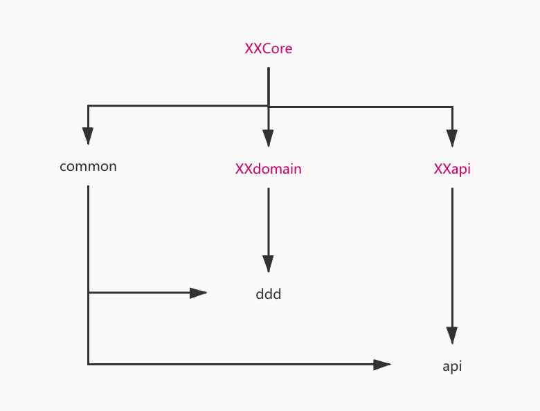

## HAWK project Structure Description

### 标准服务说明：

一个标准服务由以下几个模块组成：

- XXapi， 负责定义api接口请求或响应数据。

  - com.oc.hawk.XX.api.command, 封装需要添加/修改数据请求参数, 如注册项目RegisterProjectCommand
  - com.oc.hawk.XX.api.dto， 封装请求返回数据，包括resetful api或kafka 发送事件数据。
  - com.oc.hawk.XX.api.event， 服务支持的事件类型。

- XXcore，应用层， 负责提供服务对外通讯，通讯方式主要由HTTP Restful，Kafka消息，GRPC接口，Websocket接口，基于DDD分层架构+六边形架构模型。

  - com.oc.hawk.XX.application，定义应用层。

    1. UseCase, 相关类型的用例， 如ProjectUseCase，即Project相关功能的入口。
    2. Factory， 用于创建相关领域对象，一般参数为XXCommand，如ProjectFactory，将请求参数转换成领域对象。一般创建领域对象会相对复杂，所有提出相关创建逻辑。
    3. Representation,  用于封装请求数据，主要讲领域对象转换成相关dto，有些页面需要的数据并不包含在领域对象中，可以引入相关facade或repository获取。

  - com.oc.hawk.XX.port， 在六边形架构模型中的，端口/适配器的定义。简单来说就是所有进/出应用层都需要经过此处。

    - driving，定义进入的接口, 所有driving处理的逻辑都仅能交由应用层的UseCase处理

      1. event， 事件消息处理，如DomainEventConsumer, 用于接受kafka消息事件。

      2. facade/reset， Resetfull 接口定义，如XXXController。 

    - driven，定义访问其他资源的接口

      1. facade，主要实现领域层或其他层的facade接口，将调用相关gateway或kafka，发送或接收外部数据，并将数据(主要是DTO)转换成领域对象。
         - gateway，主要实现feign方式调用其他服务。
      2. persistence，实现领域层的仓储接口（repository）， 目前使用hibernate方式实现。
         - po， 持久化类，将领域对象转换成持久化类，交由hibernate处理。

- XXdomain， 领域层， 主要业务逻辑，如验证，数据修改等业务逻辑。业务逻辑是纯java类，不依赖其他类库（如Spring）

  - com.oc.hawk.XX.domain.config, 领域服务所需要的配置信息。
  - com.oc.hawk.XX.domain.facade， 定义所需要数据的接口，数据是由其他服务提供，主要在core模块中的port/driven/facade实现。
  - com.oc.hawk.XX.domain.model， 定义业务所需要的聚合，一个聚合一个包。如com.oc.hawk.XX.domain.model.aggr1 每一个聚合需要定义一个聚合根，如Aggr1.java。聚合根之间使用ID相互引用。每一个聚合包括
    1. Repository， 聚合所需仓库定义。
    2. ID, 聚合的唯一标示
    3. exception， 聚合使用的相关异常信息定义。
  - com.oc.hawk.project.domain.service, 领域服务，每一个类一个主方法（public方法），即一个服务类只做一件事。领域服务可以使用其他领域对象的聚合根、仓库等资源。

- api，基础类型定义，如异常类型，通用的常量定义。

  - com.oc.hawk.api.constant，通用常量定义。
  - com.oc.hawk.api.exception， 服务基本异常定义。

- common，封装服务核心使用的类库，配置及工具类，包括

  - com.oc.hawk.common.spring.config，包含所有配置信息，目前支持几种通用配置包括：

    1. BaseConfiguration， 基础配置信息，所有服务至少要引用此配置文件，主要定义包扫描路径、feign相关配置信息，引入Kafka配置。
    2. WebConfiguration， web服务配置信息， 定义数据转换逻辑等。
    3. WebSocketBrokerConfiguration，websocket配置信息，使此服务支持响应websocket通讯。
    4. AsyncConfiguration， 支持异步处理，主要定义异步处理线程池。可以使用@Async。

    所有定义的配置，使用时需要@Import即可。

  - com.oc.hawk.common.spring.log, 通用日志配置，所有服务均需要引入此配置。

  - com.oc.hawk.common.spring.cloud， 用于封装spring cloud相关技术，

    1. KafkaEventPublish，用于发布事件，可以发布自定义事件或领域事件，目前使用kafka方式实现。

  - com.oc.hawk.common.spring.mvc，封装spring mvc通用功能，包括错误异常统一处理，返回值定义（BooleanWrapper, EmptyWrapper）
  - com.oc.hawk.common.spring.support.cache: 对于缓存使用的技术封装
    - DistributedLock， 分布式锁，目前有Redis实现
  - com.oc.hawk.common.test， 单元测试
    - TestHelper： 测试帮助类，用于自动生成各种类型的测试数据，包括基础类型(Integer, Long, String等)，也包括生成指定class类型的对象。
    - BaseTest：所有单元测试的基类。
  - com.oc.hawk.common.utils 所有工具类

hawk项目主要由以下几种服务组成：

- base: 负责处理用户，部门，授权等业务。
- project：负责对项目管理，如注册，构建等业务。
- container：将业务数据转成通用容器管理标准（spec），如将创建服务的instance信息传换成InstanceConfigDTO, 后续由k8s服务处理。
- kubernetes， 将各种Spec文件信息转换成yaml配置信息，交由kubernetes执行。
- kubernetes-keepalive，主要处理kubernetes主动发送的数据，如kubernetes广播的的事件，或长时间watch 某一个服务的日志等信息。将信息通过kafka或websocket等方式通知出来。
- monitor, 处理监控相关信息，对接influxdb（之后会替换为prometheus）， 将监控指标加工处理，提供api供web或其他服务使用。
- message： 用于监控所有领域事件，收集，并提供api读取。
- performance(需要重构，暂时不可用)： 基于jmeter，用于创建执行压测，并记录相关指标信息。
- gateway： api gateway 所有web请求统一入口，负责转发，鉴权。
- traffic： 创建、查询分组，设置分组可见度。创建、查询、导入、删除接口配置。查询接口调用链路。